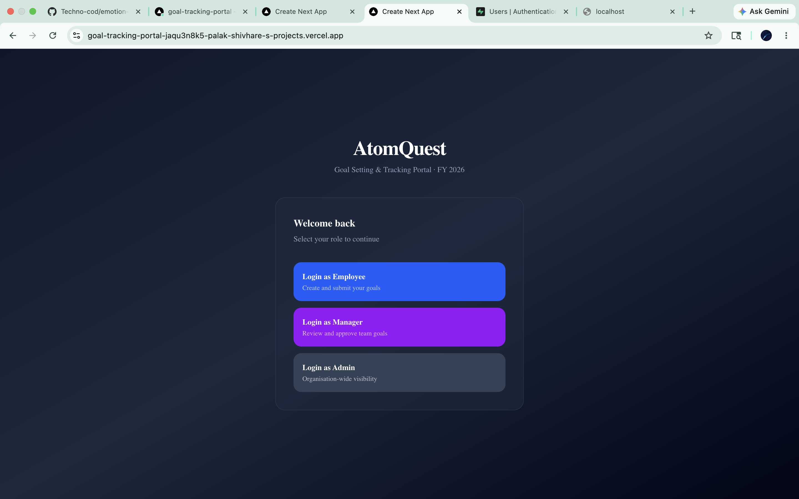
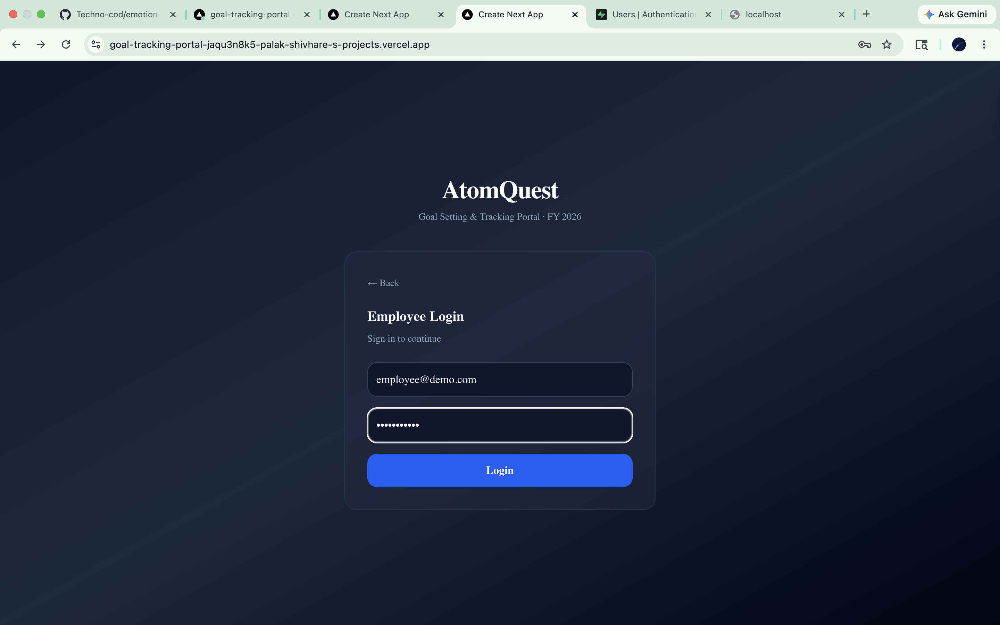
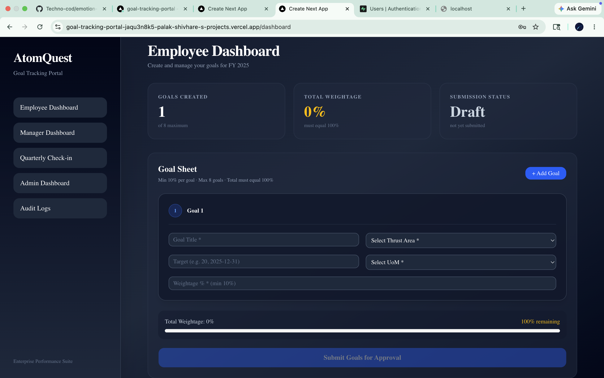
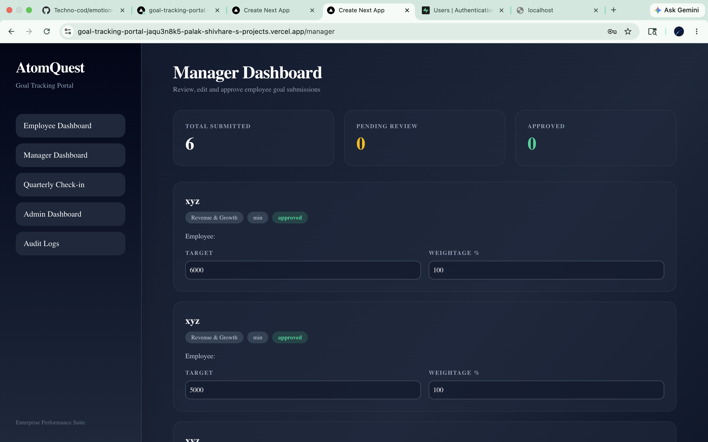
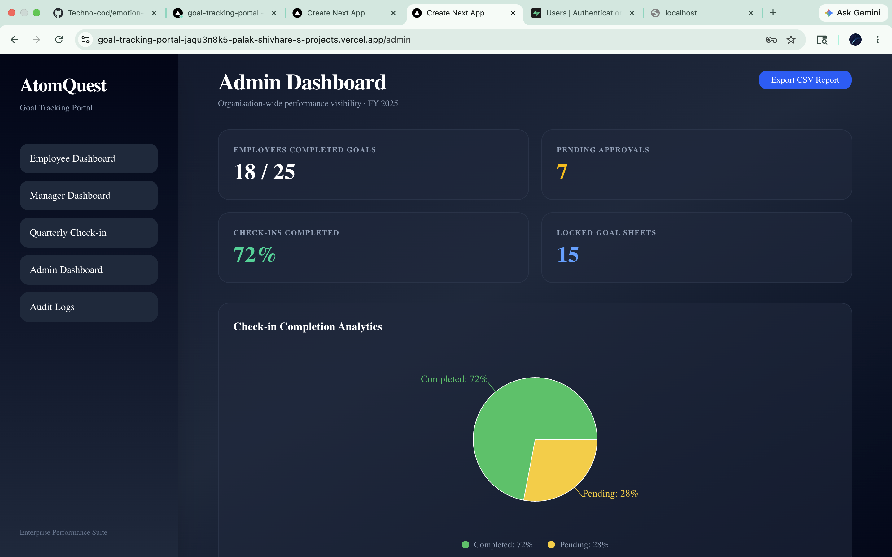
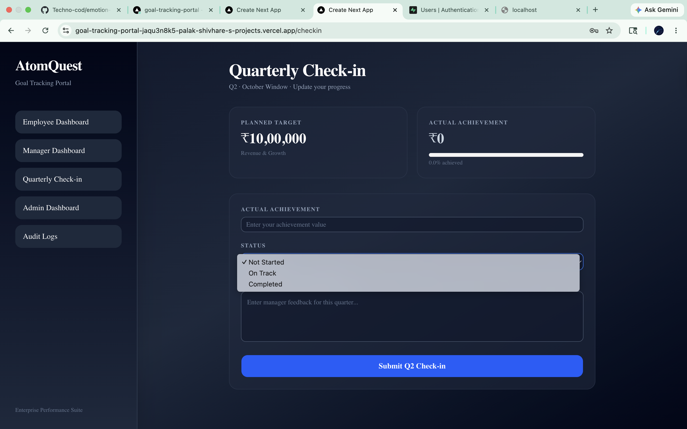
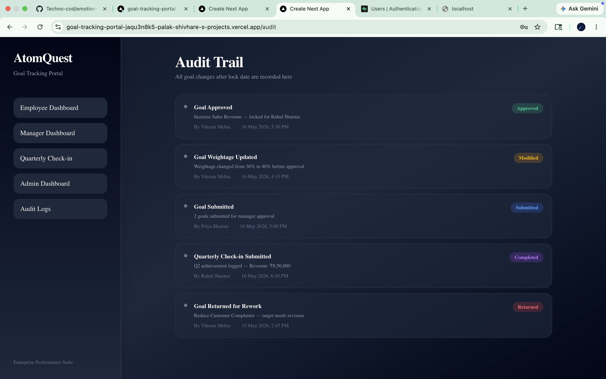

# AtomQuest

### Enterprise Goal Setting & Performance Tracking Platform

## 📌 Overview

AtomQuest is a full-stack enterprise performance management platform designed to streamline organisational goal setting, manager approvals, quarterly check-ins, and administrative tracking.

The platform enables employees to create measurable KPIs, managers to review and approve submissions, and administrators to monitor organisation-wide progress through analytics dashboards and audit trails.

Built as a modern SaaS-style application using Next.js, Supabase, and Tailwind CSS.

## 🚀 Features

### 👨‍💼 Employee Module
- Create and manage KPI goals
- Add targets, weightage, thrust areas, and UoM
- Submit goal sheets
- Goal locking after submission
- Quarterly check-in support

### 🧑‍💼 Manager Module
- Review employee submissions
- Inline editing of targets and weightage
- Approve or return goals
- Real-time goal fetching from database
- Dynamic approval workflow

### 🛡️ Admin Module
- Organisation-wide analytics dashboard
- KPI tracking
- Export reports
- Audit trail monitoring
- Workflow visibility

### 🔐 Authentication & Security
- Supabase Authentication
- Role-based access control
- Protected routes
- Secure login/logout flow

### 📊 UI/UX
- Modern dark SaaS dashboard design
- Responsive layouts
- Glassmorphism-inspired UI
- Interactive analytics cards

## 🛠️ Tech Stack

### Frontend
- Next.js
- TypeScript
- Tailwind CSS

### Backend & Database
- Supabase
- Supabase Authentication
- PostgreSQL

### Deployment
- Vercel

## 🏗️ Architecture

Employee Dashboard
↓
Supabase Database
↓
Manager Approval Workflow
↓
Admin Analytics Dashboard

Authentication handled using Supabase Auth.
Deployment hosted on Vercel.

## 📸 Screenshots
### Login Page


### Employee Login page


### Employee Dashboard


### Manager Dashboard


### Admin Dashboard


### Checkin Dashboard


### Audit Dashboard


## 🔄 Workflow

1. Employee logs in and submits goals
2. Goals are stored in Supabase
3. Manager reviews submissions
4. Manager approves or returns goals
5. Approval states persist in database
6. Admin monitors analytics and audit logs

## 🌟 Future Enhancements

- AI-driven performance insights
- Email notifications
- Real-time collaboration
- Advanced analytics
- Organisation hierarchy management
- Calendar integration
- Performance trend prediction

## ⚙️ Run Locally

```bash
git clone <repo-url>
cd goal-tracking-portal
npm install
npm run dev


---

# 10. DEPLOYMENT

```md
## 🌐 Live Deployment

Deployed on Vercel.

